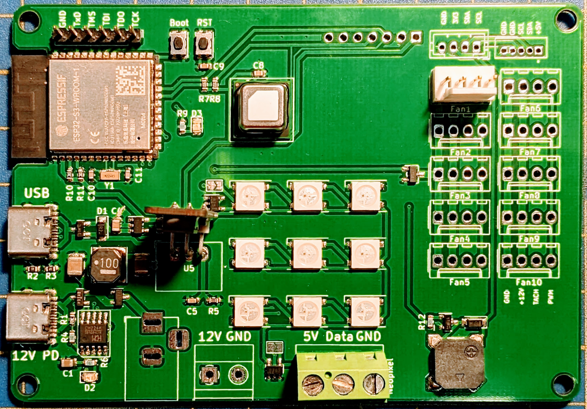
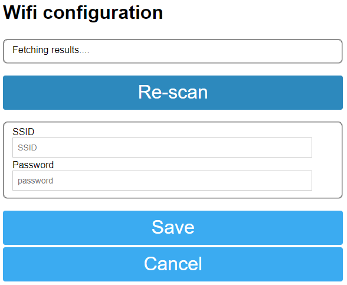
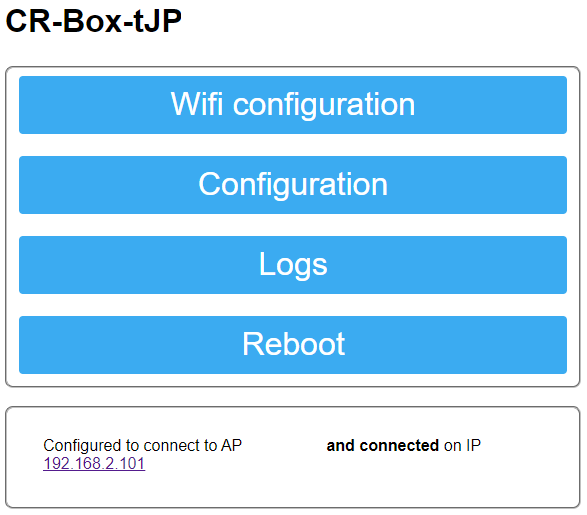
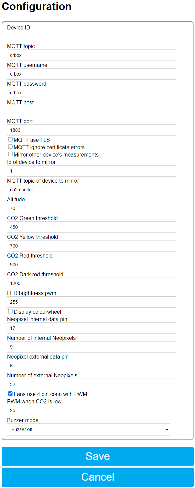

# Fan controller and CO2 Monitor for Corsi-Rosenthal boxes

An ESP32 based controller with integrated CO2 Monitor for PC-fans used in [Corsi-Rosenthal boxes](https://en.wikipedia.org/wiki/Corsi%E2%80%93Rosenthal_Box) and other diy air filters.

See [here](https://github.com/oseiler2/CO2Monitor) for some additional background on CO2 monitoring.



## Motivation

Many commercial air filters are expensive, under-dimensioned and noisy. Corsi-Rosenthal boxes are easy to make and very efficient air filters used to clean the air from airborne viral particles, allergens, smoke and other irritants.

The classic CR box design uses a box fan, which has some disadvantages:
- hard to get in some regions
- using mains voltage which can be a perceived or very real risk in some environments, e.g. classrooms
- can be noisy (depending on the fan)
- not easy to control

More recent designs have been replacing the box fan with an array of comparatively large, pressure optimised PC case fans, for example 9 x 140mm fans in a 3x3 grid on top of a 20 inch filter panel CR box. The smaller size of the fans also allows more flexibility in designing more portable CR boxes using 2 smaller filter panels.

Low speed PC fans are also much quieter and operate on safe 12V power.

By keeping the noise as low as possible and addressing the other above concerns the acceptance and tolerance of CR Boxes is increased. Commercial air cleaners are often turned off, or set to minimum levels, which contradicts their purpose. Further this controller and the operation of the fans and effectiveness can be monitored remotely.


[Learn more about this small CR box pictured below](https://github.com/oseiler2/HalfSizeCrBox)

[](https://github.com/oseiler2/HalfSizeCrBox)


# Sections

- [Features](#features) gives an overview of the capabilities and general operation
- [Hardware](#hardware) describes the board in more detail, which fans to use and how to connect them
- [PCBs](#pcbs) has more details on the design of the boards
- [Firmware](#firmware) describing the device's software features and how to use them
- [Cofiguration](#configuration) describing the device's software features and how to use them
- [Sensors](#sensors) has more information on the available sensors
- [Calibration](#calibration) has some important information on keeping the readings accurate

# Features

## General operation

The controller constantly assesses the air quality using the integrated CO2 monitor, air quality data via MQTT, or additional sensors connected via I2C, and regulates the fan speed accordingly. This will keep the airflow and related noise low while the air quality is generally good, either from good natural ventilation, or vacancy of the room. The integrated lights can reflect the air quality by showing a continuous spectrum from green via yellow to red and purple, or if configured just cycle through all colours. An integrated buzzer can also be used to alter on air quality threshold changes.

MQTT integration allows capturing all measured data and displaying on dashboards, as [documented here](https://github.com/oseiler2/CO2Monitor/blob/main/docker/docker.md).

## Key features

- Speed controller for 10 or more PC fans to regulate air flow depending on air quality
- compatible with 3 (no pwm) or 4 (pwm) pin. Non-pwm 3 pin fans are controlled using an integrated MosFET driven by a PWM signal
- 9 bright internal colour LEDs to indicate air quality with the option to connect more WS2812 (Neopixel) based LEDs
- integrated CO2, temperature and humidity sensor,
- alternatively capability to consume CO2 readings from another CO2 monitor via MQTT (eg [CO2Monitor](https://github.com/oseiler2/CO2Monitor))
- WiFi and MQTT enabled for reporting and/or consuming CO2 readings and remote configuration
- integrated buzzer to alert of poor air quality, or changes in air quality
- USB-PD compatibility to power everything off a USB-PD enabled power supply (phone charger)
- 12V direct input using 5.5x2.1mm Barrel Jack
- I2C connector to integrate other sensors
- SPS30 Particulate Matter sensor connector

# Firmware

[](https://github.com/oseiler2/CR-Box-Monitor/actions/workflows/pre-release.yml)
[](https://github.com/oseiler2/CR-Box-Monitor/actions/workflows/tagged-release.yml)

## Firmware flashing

The firmware can be flashed onto the board directly from a supported browser [from here](https://oseiler2.github.io/CR-Box-Monitor/).

## Wifi

When not connected to a configured WiFi, the controller will automatically create an Access Point using the SSID CR-Box-<ESP32mac>. Connecting to this AP allows the Wifi credentials for the monitor to be set. The AP can also be forced by pressing the `Boot` button for less than 2 seconds.



The firmware also supports WiFi configuration using [Improv Wifi](https://www.improv-wifi.com/) when connected via USB to a computer and using a supported browser [from here](https://oseiler2.github.io/CR-Box-Monitor/).

A password for the AP can be configured in the file `extra.ini` which needs to be created by copying [extra.template.ini](extra.template.ini) and applying the desired changes.

## Configuration

The controller is configured via the `config.json file on the ESP32 file system. There are 3 ways the configuration can be changed:

- via the Web Interface
- by directly editing [config.json](data/config.json) and uploading it via `Upload Filesystem Image`
- via MQTT (once connected)

### Web Interface

Navigating a browser to the controller's IP address will open the Web Interface. Here you can select to Change the Wifi configuration, the more generic device configuration, look at logs or reboot the device.

The Web Interface can be protected by setting a username and password in the file `extra.ini` which needs to be created by copying [extra.template.ini](extra.template.ini) and applying the desired changes.





- `Device ID` unique id of the device, mainly used for MQTT
- `MQTT topic`, `MQTT username` , `MQTT password`, `MQTT host`, `MQTT port`, `MQTT TLS`, `MQTT ignore certificate errors` are all used to configure the MQTT host connection
- `Mirror other device's measurements` can be enabled to consume readings from another monitor using the `ID of device to mirror` and `MQTT topic of device to mirror` MQTT settings if the controller is not outfitted with a CO2 sensor
- `Altitude` is used to calibrate the SCD30/SCD4x CO2 sensor
- `CO2 Green threshold` sets the lower limit at which the fans will be set to idle speed. Any higher CO2 measurements increase the fan speed.
- `CO2 Yellow threshold`, `CO2 Red threshold`, `CO2 Dark threshold` set the limits for changing the LED colours and fan speed. The fan speed is continously increasing from the idle speed (green) to 50% (yellow) to full speed (red).
- `LED brightness PWM` sets the LED brightness on a scale from 0 to 255
- `Display colourwheel` changes the LEDs to circle throw all colours instead of reflecting air quality readings. This can be useful when no attention should be drawn to current CO2 levels.
- `Neopixel internal data pin` should be left at `17` and `Number of internal Neopixels` at `9` unless a different PCB configuration is being used.
- `Neopixel external data pin` should be set to `0` when no additional Neopixels are connected to the screw terminal, and set to `6` otherwise. `Number of external Neopixels` should be set to the number of additional Neopixels
- `Fans use 4 pin connector with PWM` needs to be enabled to control PWM enabled fans. If unticked the fan GND connection will be PWM driven to control 3-pin fans.
- `PWM when CO2 is low` sets the idle fan speed on a scale from 0 to 255. This should be set high enough that the fans do start up and keep spinning slowly, otherwise sufficient airflow cannot be guaranteed and the internal CO2 sensor might not give accurate readings.
- `Buzzer mode` configures the integrated buzzer to be always off, beep on every level change, or give a number of beeps depending on the CO2 level for each measurement.

### MQTT

Sensor readings can be published via MQTT for centralised storage and visualition. Each node is configured with its own id and will then publish under `crbox/<id>/up/sensors`. The top level topic `crbox` is configurable. Downlink messages to nodes can be sent to each individual node using the id in the topic `crbox/<id>/down/<command>`, or to all nodes when omitting the id part `crbox/down/<command>`

SCD3x/SCD4x

```
{
  "co2": 752,
  "temperature": "21.6",
  "humidity": "52.1",
  "fanPwm": 25
}
```

BME680

```
{
  "iaq": 19,
  "temperature": "19.2",
  "humidity": "75.6",
  "pressure": 1014
}
```

SPS30

```
{
  "pm0.5": 16,
  "pm1": 19,
  "pm2.5": 19,
  "pm4": 19,
  "pm10": 19
}
```

Sending `crbox/<id>/down/getConfig` will triger the node to reply with its current settings under `crbox/<id>/up/config`

```
{
  "appVersion": "1.0",
  "mac": "xxyyzz",
  "ip": "1.2.3.4",
  "scd40": true,
  "scd30": true,
  "bme680": true,
  "sps30": true,
  "sps30AutoCleanInt": 604800,
  "sps30Status": 0,
  "mqttTopic": "crbox",
  "mqttUsername": "crbox",
  "mqttHost": "1.2.3.4",
  "mqttServerPort": 1883,
  "mqttUseTls": true,
  "mqttInsecure": false,
  "mqttMirror": false,
  "mqttMirrordeviceId": 1,
  "mqttMirrorTopic": "co2monitor",
  "altitude": 5,
  "co2GreenThreshold": 450,
  "co2YellowThreshold": 700,
  "co2RedThreshold": 900,
  "co2DarkRedThreshold": 1200,
  "brightness": 255,
  "colourWheel": false,
  "neopixelIntData": 17,
  "neopixelIntNumber": 9,
  "neopixelExtData": 6,
  "neopixelExtNumber": 32,
  "fanHasPwm": true,
  "minPwm": 25,
  "buzzerMode": 0,
  "tempOffset": "4.0"
}
```

A message to `crbox/<id>/down/setConfig` will set the node's configuration to the provided parameters. Note that changes to the hardware configuration will trigger a reboot.

```
{
  "deviceId": 1,
  "mqttUsername": "crbox",
  "mqttPassword": "crbox",
  "mqttTopic": "crbox",
  "mqttUsername": "crbox",
  "mqttHost": "1.2.3.4",
  "mqttServerPort": 1883,
  "mqttUseTls": true,
  "mqttInsecure": false,
  "mqttMirror": false,
  "mqttMirrordeviceId": 1,
  "mqttMirrorTopic": "co2monitor",
  "altitude": 5,
  "co2GreenThreshold": 450,
  "co2YellowThreshold": 700,
  "co2RedThreshold": 900,
  "co2DarkRedThreshold": 1200,
  "brightness": 255,
  "colourWheel": false,
  "neopixelIntData": 17,
  "neopixelIntNumber": 9,
  "neopixelExtData": 6,
  "neopixelExtNumber": 32,
  "fanHasPwm": true,
  "minPwm": 25,
  "buzzerMode": 0,
  "tempOffset": "4.0"
}
```

A message to `crbox/<id>/down/setTemperatureOffset` will set the SCD3x/SCD4x's temperature offset (float, °C):

```
4.0
```

A message to `crbox/<id>/down/calibrate` will manually calibrate the SCD3x/SCD4x sensor to the given value:

```
412
```

A message to `crbox/<id>/down/setSPS30AutoCleanInterval` will set the SPS30 fan auto-clean interval in seconds to the given value:

```
604800
```

A message to `crbox/<id>/down/cleanSPS30` will run a fan clean on the SPS30.

A message to `crbox/<id>/down/installMqttRootCa` will attempt to install the pem-based ca cert in the payload as root cert for tls enabled MQTT connections. A connection attempt will be made using the configured MQTT settings and the new cert, and if successful the cert will be persisted, otherwise discarded.

A message to `crbox/<id>/down/installRootCa` will install the pem-based ca cert in the payload as root cert for OTA update requests.

A message to `crbox/<id>/down/ota` will trigger the OTA polling mechnism if configured.

A message to `crbox/<id>/down/forceota` will force an OTA update using the URL provided in the payload.

A message to `crbox/<id>/down/reboot` will trigger a reset on the node.

A message to `crbox/<id>/down/resetWifi` will wipe configured WiFi settings (SSID/password) and force a reboot.

### MQTT TLS support

To connect to an MQTT server using TLS (recommended) you need to enable TLS in the configuration by setting `mqttUseTls` to `true`. You also need to supply a root CA certificate in PEM format on the file system as `/mqtt_root_ca.pem` and/or a client certificate and key for using mTLS as `mqtt_client_cert.pem` and `mqtt_client_key.pem`. These files can be uploaded using the `Upload Filesystem Image` project task in PlatformIO. Alternatively you can set `mqttInsecure` to `true` to disable certificate validation altogether.

# Hardware

## Power

The board can be powered in 3 different ways:

1. Using a USB-PD capable power supply or phone charger, capable of delivering 12V and enough power (25W+). [charger - amazon.au](https://www.amazon.com.au/dp/B09NDG1MPP)
2. 12V direct input using 5.5x2.1mm Barrel Jack receptable
3. 12V screw terminal

Make sure to use a power supply that can deliver enough power. 140mm fans need about 150mA each. Each Neopixel can draw up to 60mA (540mA for all 9 integrated ones). The 5V DC-DC regulator is dimensioned for up to 2A - take that in mind when connecting additional Neopixels.

## Fans

Make sure to use pressure optimised low speed fans that are capable of delivering airflow at sufficient static pressure e.g. [Arctic P14](https://www.arctic.de/en/P14/ACFAN00136A) (2.4 mm H2O, 0.3 Sone, 123 m³/h) or [Arctic P12](https://www.arctic.de/en/P12/ACFAN00135A) (2.2 mm H20, 0.3 Sone, 95.7 m³/h).

The controller can read the RPM signal from the fan connected to the `Fan 1` connector

## Fan hub

The main board features up to 10 connectors for 3 or 4 pin fans. For builds where the fan cables are too short to reach to the main PCB, or when more than 10 fans should be connected, the fan hub PCB can be used to connect another 9 fans via an extension cable. To enale reading the RPM sigal connect the fan hub extension cable to the `Fan 1` connector on the main board and to the `Up` connector on the fan hub.


## Additional Neopixels

Additional [Neopixel strips](https://www.adafruit.com/category/183) can be connected using the dedicated screw terminal. Make sure to not overload the power supply and integrated 5V 2A linear regulator.

# PCBs

Main board [sources](pcb/CrBoxCo2Monitor%20V0.1/), [gerber files](pcb/CrBoxCo2Monitor%20V0.1/CrBoxCo2Monitor%20V0.1.zip) and [parts list](pcb/CrBoxCo2Monitor%20V0.1/bom.md).

Fan hub [sources](pcb/Fan%20hub%20v0.1/) and [gerber files](pcb/Fan%20hub%20v0.1/Fan%20hub%20v0.1.zip).

3d printable [board holder](stl/PCB%20holder.STL) using M3 threaded inserts

# Sensors

The presence of supported I2C based sensors/displays will be automatically detected on start-up.

## SCD3x

A SCD3x NDIR CO2 sensor can be connected to the designated footprint and will provide CO2, temperature and humidity readings via I2C. It supports a separate ready signal which is connected to the ESP32.

## SCD4x

A SCD4x NDIR CO2 sensor can be soldered directly onto the pcb and provides CO2, temperature and humidity readings via I2C.

## BME680

A BME680 sensor can be connected via the I2C JST header [Adafruit BME680](https://www.adafruit.com/product/3660), [STEMMA to JST SH Cable](https://www.adafruit.com/product/4424) to provide additional VOC and AIQ measurements.

## SPS30 Particulate matter sensor

The SPS30 sensor can be connected to the dedicated connector using a JST-ZR cable.

## other

Other I2C based sensors can be wired using the JST-PH I2C header.

# Calibration

CO2 sensors need to be regularly calibrated to provide reliable measurements. The used sensors support auto-calibration and that is enabled in the firmware. It works by looking over measurements over a period and calibrating the lowest value against 420ppm (configurable in the firmware). This is based on the assumption that the monitor 'sees' clean outside air about once a week. If that cannot be achieved the firmware also allows for a forced calibration against a given value. Please also make sure to set the altitude setting according to the monitor location. For details please check the sensor's datasheets.

Manual calibration can be triggered by pressing the `Boot` button for more than 5 seconds. Make sure the monitor has been exposed to fresh outside air for a while and be careful not to breathe towards the monitor when doing this.

Calibration can also be triggered remotely via [MQTT](#mqtt).
